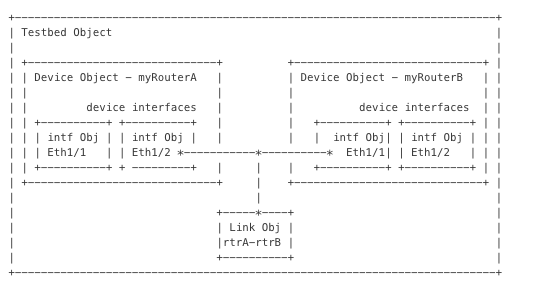

### The Topology

Prior to initiating any tests then the network needs to be described in a Topology File. 

The GENIE topology is based on the pyats topology.

The topology file is written in yaml and will describe attributes of your test network, 
such as device type login details, login method, links between devices.  

The GENIE Topology object is created by issuing the following commands:-

```python
from genie.conf import Genie

testbed = Genie.init('path_to_name_of_yaml_file')

```
This is the topology file for this lab.  The topology file describes two devices _iosxe1_ and _iosxe2_ and be found at:- [Topology](../scripts/vagrant_multi_ios.yaml)

Some important points to note with the topology file.

* The testbed must have a name - in this case IOS_NXOS_Testbed
* The devices described - their name must correspond exactly with the hostname of the device in the testbed. e.g. iosxe1 is the hostname of the first device


```yaml

testbed:
    name: IOS_Testbed
    tacacs:
        username: vagrant
    passwords:
        tacacs: vagrant
        enable: vagrant

devices:
    iosxe1:
      alias: iosxe1
      type: CSR1000v    
      os: iosxe
      connections:
        ssh:
          protocol: ssh
          ip: 127.0.0.1
          port: 3122
      custom:
        abstraction:
          order: [os, type]

    iosxe2:
      alias: iosxe2
      type: CSR1000v    
      os: iosxe
      connections:
        ssh:
          protocol: ssh
          ip: 127.0.0.1
          port: 3222
      custom:
        abstraction:
          order: [os, type]


topology:
  iosxe1:
    interfaces:
      GigabitEthernet1:
        ipv4: 10.0.2.15/24
        link: management_link
        type: ethernet
      GigabitEthernet2:
        ipv4: 192.168.100.20/24
        link: iosxe1_to_iosxe2
        type: ethernet

  iosxe2:
    interfaces:
      GigabitEthernet1:
        ipv4: 10.0.2.15/24
        link: management_link
        type: ethernet
      GigabitEthernet2:
        ipv4: 192.168.100.21/24
        link: iosxe1_to_iosxe2
        type: ethernet
```


The topology file for this lab can be found at:- [Topology](../scripts/vagrant_multi_ios.yaml)


Once the topology file has been initiated with ```Genie.init('path_to_yaml_file')``` a testbed object will be created.  
The testbed object will have a number of attributes and methods, a set of these are described in the diagram below



### Load the Genie Library and instantiate the testbed file

```bash
$cd scripts

$iPython
```
Change directory and run an iPython interactive shell:-

```python
from genie.conf import Genie

testbed = Genie.init('vagrant_multi_ios.yaml')

```

The topology object that has been created is called testbed.  Now look at some of the attributes
of the topology object by issuing the following commands

```python

testbed.devices 

testbed.name 

testbed.interfaces

```

The topology object also has a number of methods associated with it.  We shall be leveraging the connect 
method - _testbed.connect()_ in order to initiate connections to each of the devices.  


[Beginning](../README.md)   [Back](./step1.md)  [Next](step3a.md)